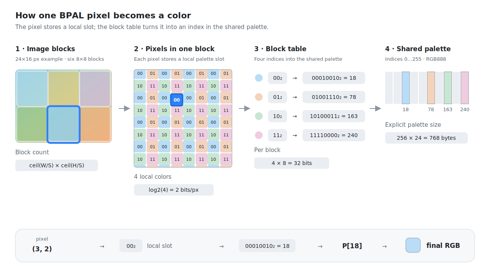
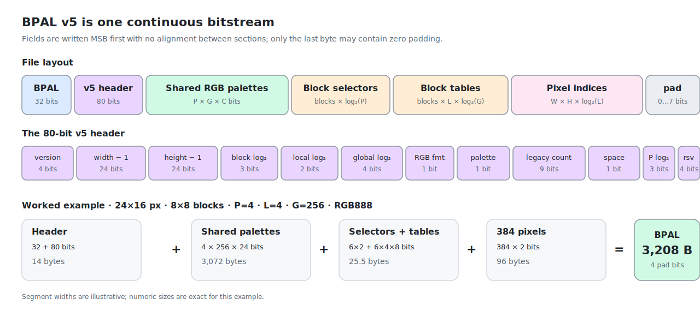
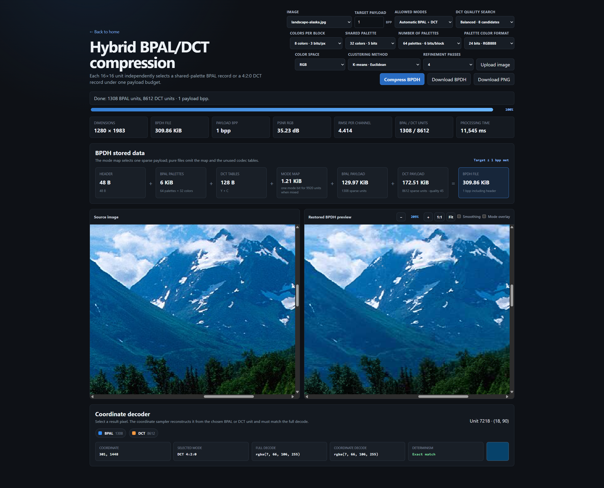

# Block Palette Compression

An experimental image-codec laboratory centered on deterministic random access.
The repository develops palette, transform, hybrid, mipmapped, adaptive-block,
and pattern-dictionary formats whose decoders can obtain a pixel by coordinate
without reconstructing the complete image first.

[Open the live demo on GitHub Pages.](https://witali.github.io/block-palette-compression/)

## Image formats under development

The common design requirement is deterministic coordinate sampling: the color
returned for `(x, y)` must not depend on decode order, neighboring decoder
state, thread scheduling, or a previously reconstructed RGBA image. The GPU
paths upload packed palettes, records, or file bytes and run the corresponding
coordinate decoder in the shader.

| Format | Current version | Purpose and storage model | Coordinate access and support |
| --- | ---: | --- | --- |
| **BPAL** (`.bpal`) | 5 | The baseline block-palette format. Fixed-size blocks select one of up to 128 shared RGB565 or RGB888 palettes, store a small table of palette-local colors, and normally store one local slot per pixel. | Direct block and pixel indexing. Supported by the compressor, Image Viewer, WebGL1/WebGL2 demos, and native CPU/CUDA tools. |
| **BPLM** (`.bplm`) | 1 | A complete BPAL base image followed by a precomputed mip chain. Every level reuses the palettes stored by the base image and can use regular local indices or direct palette indices. | Select a mip level, then use the same bounded palette lookup. Supported by the compressor, Image Viewer, and WebGL mip/cube samplers. |
| **DCTBS2** (`.dctbs2`) | 2 | A transform-coded alternative with independent `16x16` YCbCr 4:2:2 MCUs and fixed record sizes from 0.75 to 9 bpp. Higher-rate modes split luma into four `8x8` transforms; optional directly addressed prototype libraries reduce coefficient residuals. | One fixed MCU record, its quantization metadata, and an optional prototype entry are sufficient for a pixel. Supported by the DCT page, the WebGL2 Cube shader, and the native CUDA tool. |
| **BPDH** (`.bpdh`) | 1 | The content-adaptive hybrid. Every `16x16` coding unit independently selects a sparse shared-palette BPAL record or a YCbCr 4:2:0 DCT record under a common payload budget. | The mode map selects one local record; fixed-point reconstruction makes CPU and shader sampling byte-deterministic. Supported by its encoder page, Image Viewer, and the WebGL1/WebGL2 Cube. |
| **BPAV** (`BPAV` magic) | 1 | An adaptive-block BPAL side format. Every `64x64` supertile selects a `4x4`, `8x8`, `16x16`, or `32x32` block layout, with one shared-palette table per used block-size mode. | A supertile directory gives the mode and block-stream offset directly; the WebGL2 `R32UI` sampler needs at most eight word reads per pixel. This is a benchmarked research format, not yet a Viewer/PWA file type. |
| **BPDI** (`BPDI` magic) | 3 | A lossless post-compression of BPAL pixel-index patterns. Blocks can use raw indices, runs, exact or transformed dictionary references, and bitmap-coded deltas while preserving the decoded BPAL RGB values. | Checkpoint offsets bound the default payload search to 15 preceding block tags. JavaScript and WebGL2 decoders are tested; hybrid encoding keeps ordinary BPAL whenever BPDI is not smaller. |

The formats form two related lines. `BPAL` is the palette baseline and `BPLM`
adds stored mip levels without changing its color model. `DCTBS2` is the
independent transform baseline, while `BPDH` chooses between palette and DCT
coding according to local content. `BPAV` explores spatially adaptive BPAL
block sizes, and `BPDI` explores lossless reuse of the already quantized BPAL
index patterns. BPAV and BPDI remain research containers until their measured
gain justifies adding them to the public applications.

## How BPAL works

The image is split into fixed-size blocks. Normally a pixel stores a compact
local slot, the block table maps that slot to an index in a shared image
palette, and the block's palette selector chooses which shared palette
provides the final RGB color. When the block has one color entry per pixel,
the table entries map directly to pixel positions and pixel indices are
omitted. BPAL v5 supports 1, 2, 4, 8, 16, 32, 64, or 128 shared palettes, using
0 to 7 selector bits per block.



The file uses a single tightly packed bitstream. Header fields, palette colors,
block-table indices, and optional pixel indices begin immediately after one
another; only the final byte may need zero padding.



## Multi-palette BPAL v5

The multi-palette encoder groups blocks by content before quantizing their
colors. Each block is described by the mean and standard deviation of its
colors in RGB or OKLab, deterministic clustering assigns the block to one of
the requested palettes, and every cluster receives its own explicitly stored
shared palette. A block then stores a `log2(palette count)`-bit selector in
addition to its local color table, while pixels keep the same compact local
indices as in the single-palette format unless direct block colors apply.

BPAL v5 extends this model to 1, 2, 4, 8, 16, 32, 64, or 128 shared palettes. The
encoder UI exposes the palette count, reports clustering and palette-building
progress, and shows all reconstructed palettes. BPAL/BPLM serialization, the
viewer, mip generation, the WebGL cube demos, and the compact WebGL2 shader
path all preserve the per-block palette selectors. Decoders accept BPAL v5.

The bundled [32-palette landscape BPLM sample](./assets/bpal/landscape-alaska-bpal-v5.bplm)
uses BPAL v5 with 32 colors per shared palette, 8 local colors per 16x16 block,
and 11 stored mip levels. See the [multi-palette compressor screenshot](./docs/images/block-palette-html-2026-07-13-13_29_15.png)
for the encoded image, storage breakdown, selected block, and reconstructed
shared palettes.

## Iterative encoder refinement

After the initial block encoding, the CPU encoder performs up to four
rate-distortion refinement passes. Each pass moves every used shared-palette
color to the RGB mean of the source pixels that currently reference it, then
reselects the block-local colors and pixel indices. A candidate pass is kept
only when it reduces exact RGB mean squared error, and refinement stops early
after convergence. This changes encoding time and reconstructed quality but
does not add fields or bits to BPAL/BPLM files and does not affect decoding.
The compressor UI lets users select zero to four passes and defaults to one.

## Hybrid BPAL/DCT mode

The experimental BPDH v1 codec selects BPAL or 4:2:0 DCT independently for
each `16x16` coding unit. Its encoder evaluates real serialized rate and exact
decoded RGB squared error, then searches the supported rate-distortion mode
assignments at the requested payload bpp. Pure BPAL and pure DCT candidates
remain available when mixed-mode signaling is not worthwhile.

BPDH stores only the BPAL and DCT records selected by the mode map. DCT units
use absolute DC coefficients, fixed quantization tables, and deterministic
fixed-point reconstruction. `sampleBpdhPixel(decoded, x, y)` obtains a pixel
from its coding unit without depending on neighboring units or decode order.
The Demo Cube does not upload a reconstructed BPDH RGBA image. It keeps
palette records and cached block-local YCbCr samples contiguous in a GPU atlas,
then obtains the final RGB color with a coordinate-based fragment-shader
function. Neighboring fragments reuse the same atlas regions through the GPU
texture cache.



The Node.js API separates compression from serialization:

```js
const { compressHybridImage } = require("./src/hybrid/bpdh-codec.js");
const {
  encodeBpdhFile,
  decodeBpdhFile,
  sampleBpdhPixel,
} = require("./src/hybrid/bpdh-format.js");

const image = compressHybridImage(rgba, width, height, {
  mode: "auto",
  targetBitsPerPixel: 4,
});
const file = encodeBpdhFile(image);
const decoded = decodeBpdhFile(file);
const color = sampleBpdhPixel(decoded, x, y);
```

`tools/benchmark_bpdh_adapter.js` exposes matching raw-RGBA encode and decode
commands for benchmark automation.

The project contains:

- [`native/win64_demo`](./native/win64_demo/README.md) — standalone 64-bit Win32/Direct3D 11 rotating-cube demo with live BPAL, BPLM, DCTBS2, BPDH, and WIC texture loading;
- [`block-palette.html`](https://witali.github.io/block-palette-compression/block-palette.html) — CPU/WebGL2 encoder, preview,
  settings search, PNG export, and BPAL download;
- [`bpdh.html`](https://witali.github.io/block-palette-compression/bpdh.html) — hybrid BPAL/DCT encoder, mode-map preview,
  coordinate decoder, PNG export, and BPDH download;
- [`bpal-viewer.html`](https://witali.github.io/block-palette-compression/bpal-viewer.html) — BPAL, BPLM, BPDH, and regular image viewer;
- [`cube.html`](https://witali.github.io/block-palette-compression/cube.html) — WebGL cube with BPAL/BPLM double indexing,
  fast cached-YCbCr or low-memory direct DCTBS2 rendering, and coordinate-based
  BPDH decoding in the fragment shader;
- [`cube-bpal-sampler.html`](https://witali.github.io/block-palette-compression/cube-bpal-sampler.html) — programmable BPAL
  mipmapping with nearest, bilinear, trilinear, and anisotropic filtering.

Detailed documentation:

- [dependency setup](./docs/SETUP.md);
- [codec and implementation](./BLOCK_PALETTE_README.md)
  ([Russian](./BLOCK_PALETTE_README_ru.md));
- [BPAL v5 file format](./BLOCK_PALETTE_FORMAT.md)
  ([Russian](./BLOCK_PALETTE_FORMAT_ru.md));
- [BPLM v1 stored-mipmap format](./BPLM_FORMAT.md);
- [DCTBS2 v2 fixed-MCU format](./DCT_FORMAT.md)
  ([Russian algorithm overview](./docs/DCTBS2_ALGORITHM_ru.md));
- [BPDH v1 hybrid BPAL/DCT format](./BPDH_FORMAT.md);
- [BPAV v1 adaptive-block format](./BPAV_FORMAT.md);
- [BPDI v3 pattern-dictionary experiment](./benchmark/results/bpdi-pattern-dictionary-clic.md);
- [hybrid BPAL/DCT research and benchmark plan](./docs/HYBRID_BPAL_DCT_PLAN.md);
- [standalone BPAL v5 CPU/SIMD and CUDA tools](./native/bpal5_simd/README.md);
- [standalone CUDA DCTBS2 encoder, decoder, and pixel sampler](./native/dct_cuda/README.md);
- [reproducible BPAL/BC/ASTC texture codec benchmark](./benchmark/README.md).

## Setup

On Windows, the setup script checks Node.js and downloads a SHA-256-verified,
project-local CUDA 13.3 developer toolchain without changing the NVIDIA display
driver or requiring administrator rights:

```powershell
.\setup.ps1
```

Use `-SkipCuda` for browser-only development or `-NoUserEnvironment` to avoid
persisting `CUDA_PATH` and `PATH`. See the [dependency setup guide](./docs/SETUP.md)
for prerequisites, downloaded components, all parameters, and CUDA validation.

## Run

Node.js is the only requirement. No package installation is needed.

```powershell
npm start
```

Open <http://127.0.0.1:8000/>.

`npm start` regenerates `assets/bpal/manifest.json` and
`assets/bpdh/manifest.json` from the bundled `.bpal`, `.bplm`, and `.bpdh`
files before starting the server. The GitHub Pages workflow runs the same
generator before uploading the site artifact, so neither Image Viewer catalog
needs to be maintained by hand.

## Install as an app

The GitHub Pages site is an installable Progressive Web App. Supporting
browsers can install it from their address bar or application menu. The app
shell is available offline after the service worker finishes installing;
large images and BPAL/BPLM/BPDH examples are cached only after they are opened.

HTML navigations use the network first so deployments remain fresh, with a
cached page as the offline fallback. Static resources return from the cache
immediately and are refreshed in the background.

When installed by a Chromium-based desktop browser, the PWA registers as a
handler for `.bpal`, `.bplm`, and `.bpdh` files. Opening any of these file types from the
operating system launches Image Viewer and passes the selected file to it. On
platforms without the File Handling API, the viewer's file picker and drag and
drop support remain available.

On Android, install the PWA in Chrome, select a `.bpal`, `.bplm`, or `.bpdh` file in the
system file manager, and share it with BPAL. The service worker receives the
Web Share Target POST request, stores the file temporarily, and opens it in
Image Viewer. GitHub Pages does not need a server-side POST endpoint.

## Test

```powershell
npm test
```

The tests cover palette quantization, block encoding, tightly packed BPAL
files, BPAL v5 format validation, texture atlas decoding, settings search,
and WebGL2 fallback behavior.
