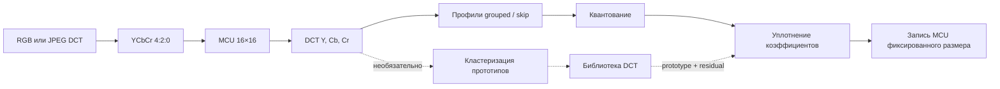
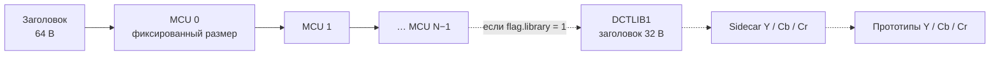
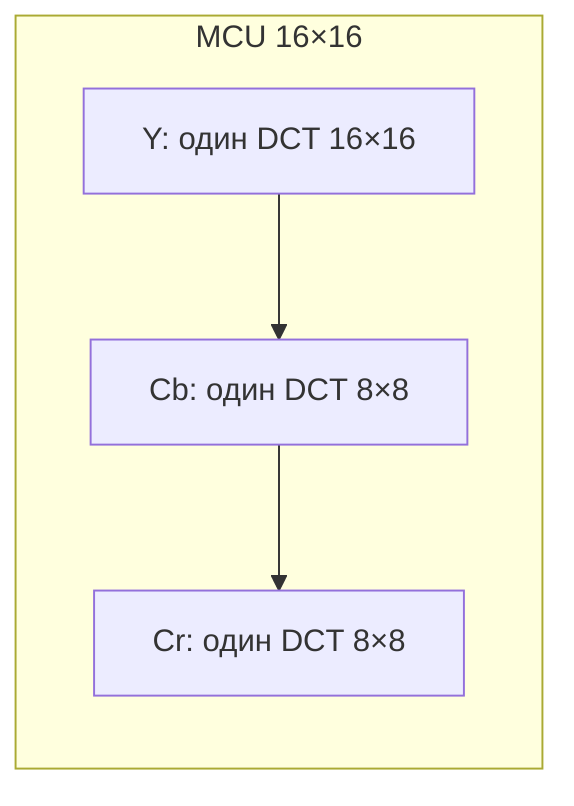
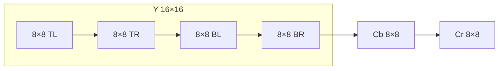
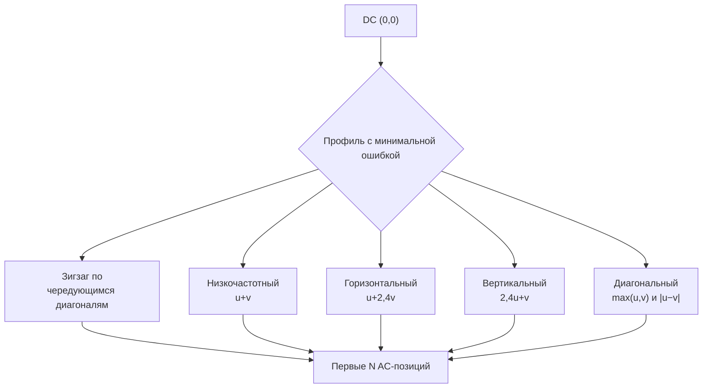
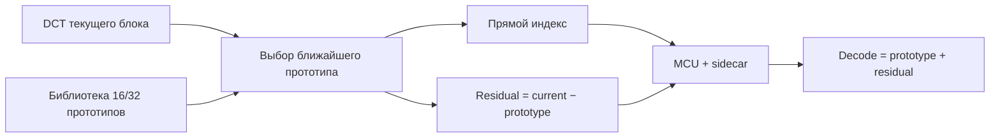
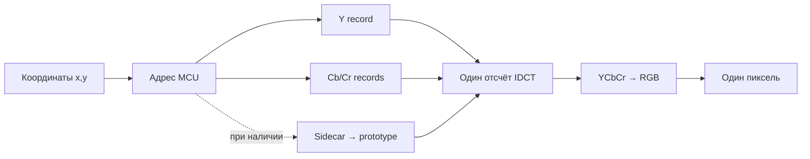

# DCTBS2: адресуемое DCT-сжатие для GPU

[Точная спецификация формата](../DCT_FORMAT.md) ·
[fragment shaders WebGL2](../src/shaders/DCTBS2_SHADERS.md) ·
[страница компрессора](../dct-compression.html)

DCTBS2 — экспериментальный формат с потерями, в котором изображение разбито
на независимые MCU размером 16×16 пикселей. Каждый MCU занимает заранее
известное число байтов. Поэтому декодер может по координатам `(x, y)` сразу
найти нужную запись, восстановить один пиксель и не преобразовывать всё
изображение.

Главная идея: перенести изображение в YCbCr, выполнить DCT, оставить ограниченное
число коэффициентов по детерминированному профилю, квантовать их и упаковать в
записи фиксированного размера. Адаптивные режимы сравнивают прежнюю grouped-запись
со skip-RLE или dual-scale skip и не меняют размер блока. Формат также может
хранить отдельную библиотеку усреднённых DCT-прототипов и локальные разности
относительно них.

> Новые DCTBS2-файлы добавляют JPEG-подобный зигзаг как профиль 0. Grouped-запись
> сравнивает его с четырьмя прежними профилями значимости, а skip-запись — с
> восемью расширенными профилями. Профиль выбирается для каждого компонентного
> блока отдельно, поэтому прежняя схема остаётся доступной, если она точнее.

## Цели и ограничения

- фиксированное число байтов на MCU при выбранном режиме;
- независимое декодирование каждого MCU;
- прямой доступ к отдельному пикселю по координатам;
- детерминированный декодер с ограниченными циклами;
- отсутствие энтропийного потока, ссылок на соседние MCU и зависимостей от
  порядка обхода;
- возможность хранить весь файл в целочисленной GPU-текстуре и декодировать
  texel во fragment shader;
- предсказуемая стоимость чтения за счёт 4:2:0, фиксированных DCT-размеров и
  степеней двойки в масштабах коэффициентов.

Цена этих свойств — некоторое ухудшение степени сжатия относительно форматов с
переменной длиной и более высокая вычислительная стоимость одной выборки по
сравнению с обычной уже распакованной RGB-текстурой.

## Конвейер кодирования



Обычный путь получает RGB-пиксели, переводит их в YCbCr и кодирует независимо
каждый MCU. Упрощённый импорт JPEG на CPU декодирует Huffman-код до DCT-данных,
деквантует исходные блоки и адаптирует их к раскладке DCTBS2 без промежуточного
RGB-прохода. Это DCT-транскодирование, а не побитовое копирование JPEG.

## Раскладка файла

Все многобайтовые числа в заголовках записаны в little-endian. Основная часть
файла состоит из 64-байтового заголовка и прямоугольной таблицы MCU. Если
включена библиотека, после таблицы MCU располагаются sidecar-индексы и записи
прототипов.



Основная формула размера без библиотеки:

```text
mcuColumns  = ceil(width / 16)
mcuRows     = ceil(height / 16)
payload     = mcuColumns × mcuRows × bytesPerMcu
fileBytes   = 64 + payload
actualBpp   = fileBytes × 8 / (width × height)
```

Из-за полных краевых MCU фактический bpp немного выше номинального, если
размеры изображения не кратны 16. Например, для 1024×1024 при режиме 1,5 bpp
полезная нагрузка равна `4096 × 48 = 196608` байт, а весь файл без библиотеки —
196672 байта, или примерно 1,5005 bpp.

### Заголовок DCTBS2 v2

| Смещение | Размер | Поле |
| ---: | ---: | --- |
| 0 | 8 | ASCII `DCTBS2\0\0` |
| 8 | 4 | версия, сейчас `2` |
| 12 | 4 | код режима |
| 16 | 4 | ширина изображения |
| 20 | 4 | высота изображения |
| 24 | 4 | число MCU по горизонтали |
| 28 | 4 | число MCU по вертикали |
| 32 | 4 | байтов на MCU |
| 36 | 4 | байтов Y на MCU |
| 40 | 4 | байтов Cb на MCU |
| 44 | 4 | байтов Cr на MCU |
| 48 | 4 | качество квантования, 1…100 |
| 52 | 4 | флаги и код упаковки коэффициентов |
| 56 | 4 | размер основной таблицы MCU |
| 60 | 4 | число проверенных quality-вариантов либо размер библиотеки |

В поле флагов bit 0 означает автоматический подбор качества, bit 1 — четыре
8×8 Y-блока, bit 2 — наличие библиотеки, bit 3 — новую цветность 4:2:0, bit 4 —
зигзагообразный порядок коэффициентов, а bits 8…11 выбирают способ упаковки.
Если bit 3 сброшен, декодер
использует прежнюю совместимую раскладку 4:2:2.

## Что находится внутри MCU

Каждый MCU покрывает 16×16 исходных пикселей. Яркость Y хранится с полным
разрешением. В новых файлах Cb и Cr имеют размер 8×8: каждый отсчёт цветности
получается усреднением области 2×2, то есть используется 4:2:0. При декодировании
цветность увеличивается до 16×16 центрированной билинейной интерполяцией внутри
того же MCU. Старые файлы с bit 3 = 0 сохраняют матрицы 8×16 и схему 4:2:2.

### Низкие режимы: 0,75–2 bpp



### Высокие режимы: 3–9 bpp



Разделение Y на четыре 8×8 DCT локализует ringing около сильных границ. Порядок
записей фиксирован: верхняя левая, верхняя правая, нижняя левая, нижняя правая,
затем Cb и Cr.

### Распределение байтов

| Режим | MCU | Y | Cb | Cr | Форма Y |
| ---: | ---: | ---: | ---: | ---: | --- |
| 0,75 bpp | 24 B | 12 B | 6 B | 6 B | 1 × 16×16 |
| 1 bpp | 32 B | 16 B | 8 B | 8 B | 1 × 16×16 |
| 1,5 bpp | 48 B | 24 B | 12 B | 12 B | 1 × 16×16 |
| 2 bpp | 64 B | 32 B | 16 B | 16 B | 1 × 16×16 |
| 3 bpp | 96 B | 4 × 16 B | 16 B | 16 B | 4 × 8×8 |
| 4,5 bpp | 144 B | 4 × 24 B | 24 B | 24 B | 4 × 8×8 |
| 6 bpp | 192 B | 4 × 32 B | 32 B | 32 B | 4 × 8×8 |
| 7,5 bpp | 240 B | 4 × 40 B | 40 B | 40 B | 4 × 8×8 |
| 9 bpp | 288 B | 4 × 48 B | 48 B | 48 B | 4 × 8×8 |

## DCT-коэффициенты и зигзагообразный порядок

После прямого DCT коэффициент `(0, 0)` является DC, остальные — AC. Кодек не
записывает матрицу целиком. Для нового потока первым кандидатом служит
JPEG-подобный зигзаг по чередующимся диагоналям. Ещё четыре ранее применявшихся
порядка значимости сохранены как дополнительные кандидаты. Кодер сохраняет
начало порядка, которое помещается в запись, и выбирает вариант с наименьшей
ошибкой.



Это не сортировка коэффициентов конкретного блока по абсолютной величине.
Позиции задаются детерминированным профилем, а кодировщик пробует пять профилей
и выбирает тот, который даёт меньшую ошибку после квантования. Поэтому GPU не
нужен список позиций из файла: зигзаг и четыре старых порядка встроены в
декодер. При снятом header bit 4 номера профилей трактуются по-старому.

## Упаковка компонентной записи

Упрощённая схема стандартной grouped-записи:

```text
bit  0                                                      bit recordBytes×8−1
     ┌────────────┬──────────────┬───────────────┬──────────────────────────┐
     │ profile 4b │ DC scale 4b  │ signed DC 10b │ group scales + AC        │
     └────────────┴──────────────┴───────────────┴──────────────────────────┘

group scales: 2×3 или 3×3 бит
AC:            последовательность signed 5-bit mantissa
остаток:       нулевые хвостовые биты
```

`profile` выбирает один из четырёх порядков значимости. `DC scale` и каждый
групповой масштаб индексируют множители `1, 2, 4, 8, 16, 32, 64, 128`. Таким
образом, вместо общего большого смещения сохраняется небольшое число степеней
двойки, а коэффициенты группы хранятся короткими знаковыми мантиссами. Декодер
восстанавливает коэффициент как:

```text
coefficient = signedMantissa × quantizationStep(u,v) × (1 << scaleIndex)
```

В grouped-варианте профилей 0,75, 1 и 2 bpp AC делятся на две примерно равные
группы. В профилях 1,5, 3, 4,5, 6, 7,5 и 9 bpp используются три группы с более
короткой первой низкочастотной частью. Старый вариант с signed 6-bit AC и
единым масштабом сохраняется для совместимости.

### Адаптивные skip-записи

В новых кодировках bit 3 первого байта отмечает skip-подрежим. Старый grouped
вариант остаётся допустимым в той же кодировке и выбирается, если даёт меньшую
ошибку. В skip-подрежиме старшая тетрада заголовка выбирает один из восьми
частотных профилей, после signed 10-bit DC идёт фиксированное число токенов:

```text
skip-RLE:          signed6 + skip2
dual-scale coarse: signed6 + skip2, основной масштаб
dual-scale fine:   signed4 + skip2, масштаб ×1 или ×2

nextIndex = currentIndex + skip + 1
```

Двухбитный `skip` позволяет перейти вперёд на 1…4 позиции профиля. Поэтому
средние и высокие частоты можно сохранить без общей маски. Число coarse/fine
токенов однозначно выводится из размера и формы записи, так что произвольный
доступ остаётся ограниченным одним MCU.

Свободные биты после базовых токенов больше не остаются нулевым padding. Первый
дополнительный signed 4-bit AC использует `skip` последнего базового токена;
каждый следующий хранит ещё `skip2 + signed4`. Кодировщик записывает ненулевое
значение только при уменьшении квадратичной DCT-ошибки. Число дополнительных
слотов однозначно выводится из размера компонентной записи и не требует нового
поля заголовка.

Итоговые режимы соответствуют последним экспериментам: 0,75 bpp использует
адаптивный обычный skip-RLE; 1, 1,5 и 2 bpp — adaptive dual-scale skip; 16- и
24-байтные записи высоких режимов 3 и 4,5 bpp также используют dual-scale skip.
Для 32-, 40- и 48-байтных записей 6, 7,5 и 9 bpp кодировщик сравнивает grouped с
mask/tail. При bit 4 = 1 bit 0 маски соответствует первому AC `DCT[1]`, bit 1 —
второму AC `DCT[8]`, а DC хранится отдельно; незанятые слоты образуют неявный
непрерывный хвост в конце зигзага. В 48-байтной
вариации также неявно присутствуют `DCT[1]` и `DCT[8]`. После перехода на 4:2:0
Cb и Cr тоже являются 8×8, поэтому mask/tail допустим для всех шести DCT-записей
высокого MCU. Автоматический режим декодирует кандидатов в RGB и оставляет новую
упаковку только при строго меньшей ошибке; при равенстве сохраняется grouped.
Старый естественный порядок с bit 4 = 0 также участвует в сравнении и остаётся
в файле, если даёт меньшую RGB-ошибку.

Шаг квантования выводится из quality, размеров DCT, фиксированной luma/chroma
таблицы в стиле JPEG и сохранённого степенного масштаба. Отдельные таблицы
квантования для каждого блока не нужны.

## Необязательная библиотека DCT-прототипов

Библиотечный режим является отдельным вариантом формата и не смешивается с
базовыми режимами. Кодировщик детерминированно кластеризует DCT-векторы Y, Cb и
Cr по всему изображению. Центр каждого кластера записывается как прототип, а
блок хранит индекс прототипа и локальную разность.



Для 16 прототипов sidecar-индекс занимает 5 бит, для 32 — 6 бит. Нулевой индекс
означает «без прототипа», остальные значения адресуют записи напрямую. Sidecar
упакован LSB-first, тогда как component record читается MSB-first. Ни один
индекс не образует цепочку и не ссылается на соседний MCU.

В spectral-split режиме прототип хранит преимущественно общую низкочастотную
основу. Локальная запись сохраняет DC-разность, часть собственных
низкочастотных коэффициентов и несколько более высокочастотных позиций. Это
соответствует задаче: общая библиотека описывает крупную структуру, а блок —
индивидуальные детали.

В конце файла библиотека начинается с 32-байтового заголовка `DCTLIB1\0`, затем
располагаются byte-aligned sidecar-потоки Y, Cb, Cr и фиксированные записи
прототипов в том же порядке компонентов.

## Доступ к одному пикселю

Для координат `(x, y)` адрес MCU вычисляется без поиска:

```text
mcuX      = floor(x / 16)
mcuY      = floor(y / 16)
mcuIndex  = mcuY × mcuColumns + mcuX
mcuOffset = 64 + mcuIndex × bytesPerMcu
```



В низких режимах локальные координаты Y равны `(x mod 16, y mod 16)`. В высоких
режимах два старших локальных бита выбирают один из четырёх 8×8 Y-блоков, а
отсчёт берётся в `(x mod 8, y mod 8)`. Для новых Cb/Cr 8×8 декодер читает четыре
соседних отсчёта и выполняет центрированную билинейную интерполяцию. Для чётной
локальной координаты используются позиции `coordinate / 2 - 1` и
`coordinate / 2` с долей 3/4, для нечётной — `coordinate / 2` и
`coordinate / 2 + 1` с долей 1/4; индексы ограничиваются краями MCU. Старый
4:2:2-путь сохраняет выборку `(floor((x mod 16) / 2), y mod 16)`.

Декодеру требуется один MCU и, в библиотечном варианте, не более одного
прототипа на компонент. В новом формате размеры циклов ограничены 16×16 и 8×8;
совместимый декодер также поддерживает старую цветность 8×16. Полный
кадр, предыдущий MCU и состояние энтропийного декодера не требуются.

## Использование как GPU-текстуры

В WebGL2 весь `.dctbs2`-файл загружается в целочисленную `RGBA8UI`-текстуру:
четыре последовательных байта файла соответствуют RGBA одного texel. Фильтр
текстуры — `NEAREST`, mipmap для потока данных не создаётся.

Fragment shader выполняет следующую последовательность для каждого экранного
фрагмента:

1. переводит UV или экранную координату в `(x, y)`;
2. вычисляет `mcuOffset`;
3. извлекает профиль, масштабы, DC и AC мантиссы;
4. при необходимости читает sidecar-индекс и прототип;
5. вычисляет только нужный пространственный отсчёт обратного DCT;
6. преобразует YCbCr в RGB.

В `src/shaders` лежат отдельные fragment shaders для всех девяти режимов от 0,75
до 9 bpp. Они поддерживают базовые grouped/legacy записи, adaptive skip-RLE и
dual-scale skip, mask/tail, разделённую Y, новую цветность 4:2:0, совместимую
4:2:2 и версии библиотеки 1…9. Адреса MCU, sidecar и прототипа вычисляются
напрямую.

Такой вариант особенно полезен для произвольных выборок, virtual texturing,
редко читаемых больших текстур и экспериментов с собственными GPU-форматами.
Если один и тот же texel фильтруется много раз каждый кадр, предварительная
распаковка в обычную GPU-текстуру может быть быстрее: билинейная выборка требует
четырёх DCT-декодирований, трилинейная — восьми.

## Перепаковка существующего DCT с потерей качества

Существующие JPEG DCT-блоки можно использовать как исходные данные: CPU
декодирует Huffman-код до квантованных коэффициентов, деквантует их,
восстанавливает компонентные YCbCr-отсчёты и преобразует их к блочной сетке
DCTBS2. Затем можно:

- отбросить позиции, не вошедшие в выбранный профиль значимости;
- повторно квантовать оставшиеся коэффициенты;
- сгруппировать их по общему двоичному масштабу;
- сохранить короткие знаковые мантиссы;
- при необходимости вычесть DCT-прототип из библиотеки;
- записать результат в фиксированные MCU-записи.

Это даёт компактный адресуемый поток, пригодный для непосредственного чтения
текстурным шейдером, но операция не является lossless. Потери появляются из-за
повторного квантования, удаления коэффициентов, приведения цветности к 4:2:0 и,
если сетки преобразований различаются, перехода между исходными 8×8 блоками и
16×16/8×8 DCTBS2. Качество поэтому следует контролировать по RGB PSNR и по
визуальным артефактам на границах блоков.

## Детерминизм декодера

Для одинакового файла CPU и GPU получают одинаковую структуру чтения:

- все адреса выводятся из заголовка, координаты и фиксированных размеров;
- четыре grouped-порядка и восемь skip-порядков встроены в реализацию;
- квантование выводится из quality и фиксированных таблиц;
- масштабы — только восемь степеней двойки;
- число коэффициентов известно из длины записи и режима упаковки;
- библиотека адресуется индексом, рекурсивных ссылок нет;
- при кодировании неполного краевого MCU значения за границей изображения
  продолжаются повторением ближайшего валидного пикселя.

Это сохраняет возможность получить каждый пиксель отдельно и делает формат
реализуемым в CUDA, compute shader или WebGL2 fragment shader без полной
распаковки изображения.
